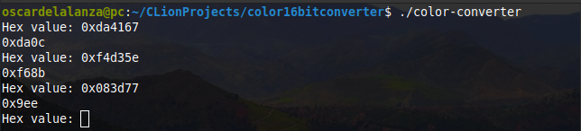

# 24 bits to 16 bits color converter

> This program is used to convert 24 bits hexadecimal color codes to 16 bits hexadecimal color codes, in order to use the
> most similar color codes from websites like `coolors.co` in any arduino board that isn't able to handle big integers.

## Built With

- `C`

## Getting Started

> To get a local copy up and running follow these simple example steps.

### Prerequisites

- `Git`
- `GCC compiler`

### Setup

To clone the project into your local environment do the following.

- Open a new `terminal` window and navigate to the directory where the project will be stored.
- Run the command `git clone git@github.com:oscardelalanza/24bit-to-16bit-color-converter.git`.
- Run the command `cd 24bit-to-16bit-color-converter` to enter to the project directory.

### Install

Compile the project to create an executable file.

- Run the command `gcc main.c -o color-converter`.

### Usage

- Start the program running the command `./color-converter`.
- Type in the terminal the 24 bit color code to convert. Use the format `0x000000`.
- The closest 16 bits color code will be printed on the screen.
- Type `0` to end the program.

### Run tests

- This project doesn't contain tests.

### Deployment

- Not needed.

## Authors

👤 **Oscar De La Lanza**

- Github: [@oscardelalanza](https://github.com/oscardelalanza)
- Twitter: [@oscardelalanza](https://twitter.com/oscardelalanza)
- Linkedin: [Oscar De La Lanza](https://www.linkedin.com/in/oscardelalanza/)
- Email: oscardelalanza@gmail.com

## 🤝 Contributing

Contributions, issues and feature requests are welcome!

Feel free to check the [issues page](issues/).

## Show your support

Give a ⭐️ if you like this project!